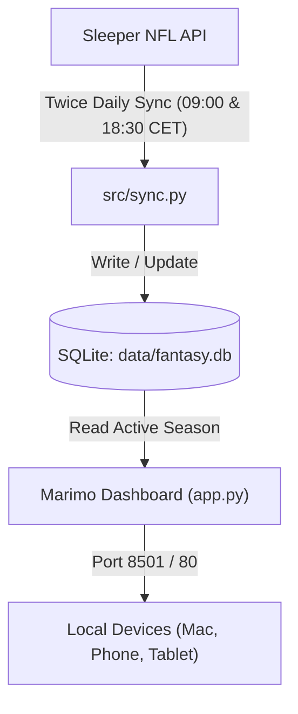
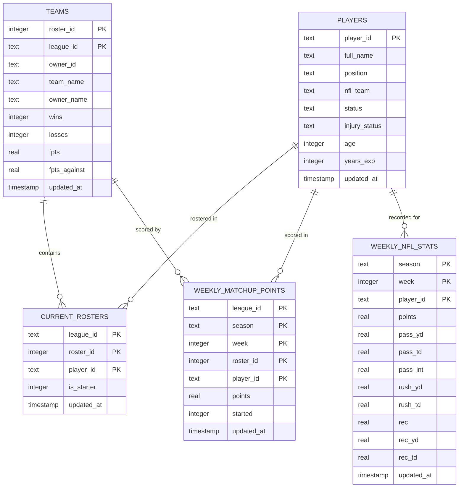

# 🏈 Sleeper Fantasy Football Analytics Dashboard

A self-hosted, reactive fantasy football analytics suite built with **Marimo**, **Pandas**, and **SQLite**, designed to run 24/7 on a **Raspberry Pi** (or any server/Docker host).

---

## 📑 Table of Contents
- [Architecture & Tech Stack](#architecture--tech-stack)
- [Database Schema](#database-schema)
- [Multi-Season & Year Separation](#multi-season--year-separation)
- [Docker & Containerization](#docker--containerization)
- [Raspberry Pi & Local Domain Setup (with Homebridge)](#raspberry-pi--local-domain-setup-with-homebridge)
- [Daily Automated Data Sync (09:00 & 18:30 CET)](#daily-automated-data-sync-0900--1830-cet)
- [Deployment & Configuration](#deployment--configuration)

---

## 🛠 Architecture & Tech Stack



- **Frontend & UI**: [Marimo](https://marimo.io) (Reactive Python notebook & web application)
- **Data Engine**: Pandas + NumPy
- **Database**: SQLite 3 (`data/fantasy.db`)
- **Containerization**: Docker & Docker Compose (Debian-based Python 3.11 with cron + tzdata)

---

## 🗄 Database Schema

The database is structured to store historical weekly statistics, player information, team standings, and roster snapshots.



### Table Breakdown

| Table | Primary Key | Description |
| :--- | :--- | :--- |
| `players` | `player_id` | Sleeper master player database (names, positions, NFL teams, injury tags). |
| `teams` | `(roster_id, league_id)` | League teams, owner names, wins, losses, total points for (PF) and against (PA). |
| `current_rosters` | `(league_id, roster_id, player_id)` | Current active ownership and starter/bench designation snapshot. |
| `weekly_matchup_points` | `(league_id, season, week, roster_id, player_id)` | Fantasy points scored per player within specific league weekly matchups. |
| `weekly_nfl_stats` | `(season, week, player_id)` | Global NFL player box scores (passing, rushing, receiving, PPR points). |

---

## 📅 Multi-Season & Year Separation

To ensure previous seasons do not mix into future seasons:

1. **Season Partitioning**:
   - `weekly_matchup_points` and `weekly_nfl_stats` store the `season` string (e.g. `'2025'`, `'2026'`).
2. **Strict Query Isolation**:
   - [`src/db.py:load_league_data()`](file:///Users/jonas/Documents/GitHub/NFL-Fantasy/src/db.py) automatically queries [`get_active_season()`](file:///Users/jonas/Documents/GitHub/NFL-Fantasy/src/db.py#L90-L105) (or takes an explicit `season` parameter) and filters:
     ```sql
     WHERE m.league_id = ? AND m.season = ?
     ```
   - This ensures aggregates (PPG, std deviation, consistency tiers, positional ranks) are calculated **strictly from the current active season**.
3. **Rollover to Next Year**:
   - When a new season starts, simply update `LEAGUE_ID` in your local `.env`.
   - The sync automatically downloads the new season's data into the database alongside previous seasons without overwriting historical records.

---

## 🐳 Docker & Containerization

### Quick Start with Docker Compose

1. **Clone the repository**:
   ```bash
   git clone https://github.com/Sunkarr/NFL-Fantasy.git
   cd NFL-Fantasy
   ```
2. **Create your private configuration file**:
   ```bash
   cp .env.example .env
   ```
   Edit `.env` with your credentials:
   ```dotenv
   LEAGUE_ID=your_sleeper_league_id
   TEAM_NAME=your_team_name
   TZ=Europe/Berlin
   PORT=8501
   ```
3. **Launch the container**:
   ```bash
   docker compose up -d --build
   ```
4. **Access the Dashboard**:
   Open `http://localhost:8501` (or your Raspberry Pi's local address).

---

## 🍓 Raspberry Pi & Local Domain Setup (with Homebridge)

Running **Homebridge and this dashboard together on the same Raspberry Pi works seamlessly** without port collisions or needing to rename your Pi.

### Why there is NO conflict:
- **Homebridge UI** typically runs on **port 8581**.
- **HomeKit Bridge (HAP)** uses ports **51826+**.
- **Marimo Dashboard** runs on **port 8501**.

---

### Option A: Use your Pi's Existing Hostname (Zero-Config)
If your Pi's current hostname is `homebridge` (or `raspberrypi`), keep it as-is. You can immediately access both services:
- **Homebridge UI**: `http://homebridge.local:8581`
- **Fantasy Dashboard**: `http://homebridge.local:8501`

---

### Option B: Clean Domain without Port (`http://fantasy.home` or `http://fantasy.lan`)
If you want a dedicated URL without port numbers (like `http://fantasy.home`), keep your Pi's hostname unchanged and route via local DNS + reverse proxy:

1. **Add a DNS Rewrite on your Router / Pi-hole / Fritz!Box**:
   - `fantasy.home` (or `fantasy.lan`) $\rightarrow$ `<Raspberry-Pi-IP>` (e.g. `192.168.1.50`)
2. **Reverse Proxy with Nginx (on Port 80)**:
   Nginx routes incoming HTTP requests based on the domain:
   ```nginx
   # /etc/nginx/sites-available/fantasy
   server {
       listen 80;
       server_name fantasy.home fantasy.lan;

       location / {
           proxy_pass http://127.0.0.1:8501;
           proxy_http_version 1.1;
           proxy_set_header Upgrade $http_upgrade;
           proxy_set_header Connection "upgrade";
           proxy_set_header Host $host;
       }
   }
   ```
   Now `http://fantasy.home` directly opens the Fantasy Dashboard!

---

### Option C: Avahi mDNS Alias (`fantasy.local` without renaming Pi)
You can broadcast `fantasy.local` alongside your existing hostname by publishing an Avahi CNAME/alias service:
- Your Pi will respond to both `http://<existing-hostname>.local` AND `http://fantasy.local:8501`.

---

## ⏰ Daily Automated Data Sync (09:00 & 18:30 CET)

The service runs automated sync cron jobs synchronized to `Europe/Berlin` / `Europe/Zurich` (CET/CEST):
- **Morning (09:00 CET)**: Captures overnight scores, stat corrections, and Monday/Thursday/Sunday night game finalizations.
- **Evening (18:30 CET)**: Captures late injury report updates, waiver wire acquisitions, and active trade adjustments before game days.
- Execution logs are saved to `data/cron.log`.
- To trigger a manual sync anytime:
  ```bash
  python -m src.sync --mode incremental
  ```

---

## 🚀 Deployment & Configuration

### 1. Initial Setup on the Pi
```bash
git clone https://github.com/Sunkarr/NFL-Fantasy.git
cd NFL-Fantasy
cp .env.example .env
nano .env  # Add your LEAGUE_ID and TEAM_NAME
docker compose up -d --build
```

### 2. Updating the Dashboard
When you make changes on your Mac and push to GitHub:
```bash
git add .
git commit -m "Update dashboard"
git push origin main
```
On the Raspberry Pi:
```bash
cd ~/NFL-Fantasy
git pull
docker compose up -d --build
```
